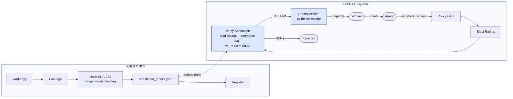

<div align="center">
  
</div>

<br/>

<div align="center">

> Stripe is the trust signal for payments. AWS is the trust signal for infrastructure.
> **pyhall is the trust signal for AI worker governance.**

[](https://workerclassprotocol.dev)
[](https://pypi.org/project/pyhall-wcp/)
[](https://www.npmjs.com/package/@pyhall/core)
[](https://github.com/pyhall/pyhall-python/blob/main/LICENSE)
[](https://pyhall.dev)

</div>

---

Every agentic system dispatches workers. Almost none of them ask: *should this worker be trusted with this job, under these conditions, with this data?*

pyhall answers that question — with a cryptographic evidence receipt for every routing decision.

---

## How it works

Write worker.py once. Attest the full package. Verify on every run.



---

## Four pillars

| | |
|---|---|
| **Govern** | Define who can run what worker, at what capability level, under which policy. Workers operate inside declared boundaries — or not at all. |
| **Attest** | Every worker carries a capability card. Every decision produces a verifiable proof — artifact hash, timestamp, correlation ID. |
| **Route** | Match work to workers by capability, policy tier, and QoS. Mismatches are rejected at the gate, not silently degraded at runtime. |
| **Observe** | Every routing decision is logged with proof. Query history, audit decisions, trace incidents. Live worker health in one monitor view. |

---

## The stack

| Component | Repo | Install |
|-----------|------|---------|
| **Python SDK** | [pyhall-python](https://github.com/pyhall/pyhall-python) | `pip install pyhall-wcp` |
| **TypeScript SDK** | [pyhall-typescript](https://github.com/pyhall/pyhall-typescript) | `npm install @pyhall/core` |
| **Go SDK** | [pyhall-go](https://github.com/pyhall/pyhall-go) | `go get github.com/pyhall/pyhall-go` |
| **CLI** | [pyhall-cli](https://github.com/pyhall/pyhall-cli) | `npm install -g @pyhall/cli` |
| **Hall Monitor** | [pyhall-desktop](https://github.com/pyhall/pyhall-desktop) | Desktop app — Mac / Win / Linux |
| **Taxonomy** | [pyhall-taxonomy](https://github.com/pyhall/pyhall-taxonomy) | 245 entities · 127 capabilities |
| **Registry** | [pyhall-registry](https://github.com/pyhall/pyhall-registry) | `api.pyhall.dev` |

---

## Quick start

```bash
pip install pyhall-wcp
```

```python
from pyhall import Hall

hall = Hall()
decision = hall.route({
    "capability_id": "cap.doc.summarize",
    "env": "prod",
    "data_label": "INTERNAL",
    "tenant_risk": "low",
    "qos_class": "P1",
    "tenant_id": "your-tenant",
    "correlation_id": "uuid-v4-here",
})

if not decision.denied:
    print(f"Dispatch: {decision.selected_worker_species_id}")
    print(f"Evidence: {decision.decision_id}")
    print(f"Hash:     {decision.artifact_hash}")
```

---

## Four steps to governed workers

```
01 PUBLISH    hall publish worker.wcp.yaml       Define a worker capability card
02 ENROLL     hall enroll --namespace x.you      Register with the pyhall registry
03 ROUTE      hall route --cap cap.doc.summarize Match request to the right worker
04 OBSERVE    hall decisions list                Audit every decision ever made
```

---

<div align="center">

**[pyhall.dev](https://pyhall.dev)** &nbsp;·&nbsp; **[WCP Spec](https://workerclassprotocol.dev)** &nbsp;·&nbsp; **[Registry](https://api.pyhall.dev)** &nbsp;·&nbsp; **[Docs](https://pyhall.dev/introduction/)**

</div>
